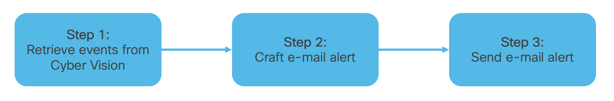

# Cisco Cyber Vision: Purge components by creation time

This collection of scripts allows to (1) consult the amount of events of high and very high severity generated in the last hour in Cisco Cyber Vision, (2) craft an e-mail alert about that amount, and (3) send that e-mail to the user. 



## Prerequisites

1. An SMTP server (e.g. GMail, or an internal SMTP server) reachable by the machine running this script.

2. A Cyber Vision API token (To be generated in the CV Center console under `Admin > API > Token`)

## Installation and usage

1. On your machine, open a terminal (CLI)

2. Clone this repository to your machine

```
$ git clone https://github.com/Stienvdh/cybervision_email_notifier.git
$ cd cybervision_email_notifier
```

3. Install the required Python libraries

```
$ pip3 install -r requirements.txt
```

4. In `email_alert.py`, fill out the required variables on lines 13-22

```
smtp_host = "<your-smtp-server-ip>"
smtp_port = "<your-smtp-server-port>"
smtp_username = "<your-smtp-server-username>"
smtp_password = "<your-smtp-server-password>"
smtp_use_tls = False
smtp_use_auth = False
smtp_from_address = "<the-email-address-to-send-emails-from>"
smtp_to_address = "<the-email-address-to-send-emails-to>"
cv_center_ip = "<your-cybervision-center-ip>" # NOTE: this is 169.254.0.42:4443 if running the script on the CV center itself
cv_token = "<your-cybervision-center-api-token>"
```

5. Run the script

```
$ python3 email_alert.py
```